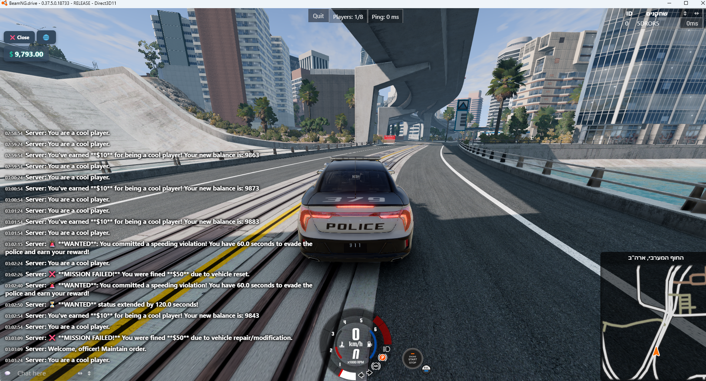

# UIMPIT - Economy & Roleplay Mod

A comprehensive server-side mod for **BeamMP** that introduces a dynamic economy, civilian vs. police roleplay mechanics, and a highly configurable gameplay experience. This mod includes a server-side script, a client-side UI (HUD), and a graphical configuration editor.

---

## ✨ Features

### 🪙 Dynamic Economy System

* Players earn money over time.
* Ability to pay other players using chat commands (`/pay`).
* Player data (money, language) is saved automatically.

### 🚓 Civilian vs. Police Roleplay

* **Automatic Role Detection:** The server automatically assigns players to “Civilian” or “Police” roles based on their vehicle’s skin.
* **Wanted System:** Civilians can become wanted by performing illegal actions like speeding or reckless driving.
* **High-Stakes Chases:**

  * Wanted civilians earn bonus money for driving near police.
  * Police earn money for pursuing wanted criminals.
* **Busting Mechanic:** Police can “bust” wanted civilians by staying close while the civilian is stopped or moving slowly.
* **Evasion Bonus:** Civilians who evade pursuit and survive the wanted timer earn large rewards.

### 💻 Modern In-Game UI (HUD)


* Clean, toggleable interface to show/hide economy and wanted status.
* Displays current money balance.
* Shows a **WANTED** timer when being pursued.

### Multi-language Support:

* Change language in-game (English, Hebrew, Arabic supported).
* Automatically adjusts for Right-to-Left (RTL) languages.

### ⚙️ Easy Configuration

* All gameplay variables (payouts, timers, speeds, distances) can be edited in a single `config.json` file.
* Includes a **Configuration Editor** tool for easy modification without touching the code.
---

## ⚙️ Installation
1. Place the **`EconomyTest`** folder in:

Resources/Server/

2. Place **`EconomyUI.zip`** in:

Resources/Client/

3. Restart your BeamMP server.
---

## 🧩 Configuration Editor

The configuration editor (`config_editor.py`) is a standalone desktop application that allows you to easily modify all core settings of the mod without editing code manually.

To use the configuration editor, you must have **Python 3** installed on your system.


> 💡 You can download Python from the official website: [https://www.python.org/downloads/](https://www.python.org/downloads/)

---

## 🧠 How to Use the Configuration Editor

> ⚠️ The configuration editor (`config_editor.py`) must be in the same folder as `config.json` and the `lang` folder.  
> On Windows you can double-click it to run, or run from the terminal:  
> ```bash
> python config_editor.py
> ```  
> On Linux, run it from the terminal:  
> ```bash
> python3 config_editor.py
> ```


## 🧠 Credits

Special thanks to **Beams Of Norway** who brought me the code to test the speed


---

## 📜 License
© 2025 5DROR5

You are free to use, modify, and distribute this mod for any purpose, including commercial use, 
as long as you give credit to the original author (5DROR5).  

No warranty is provided.
